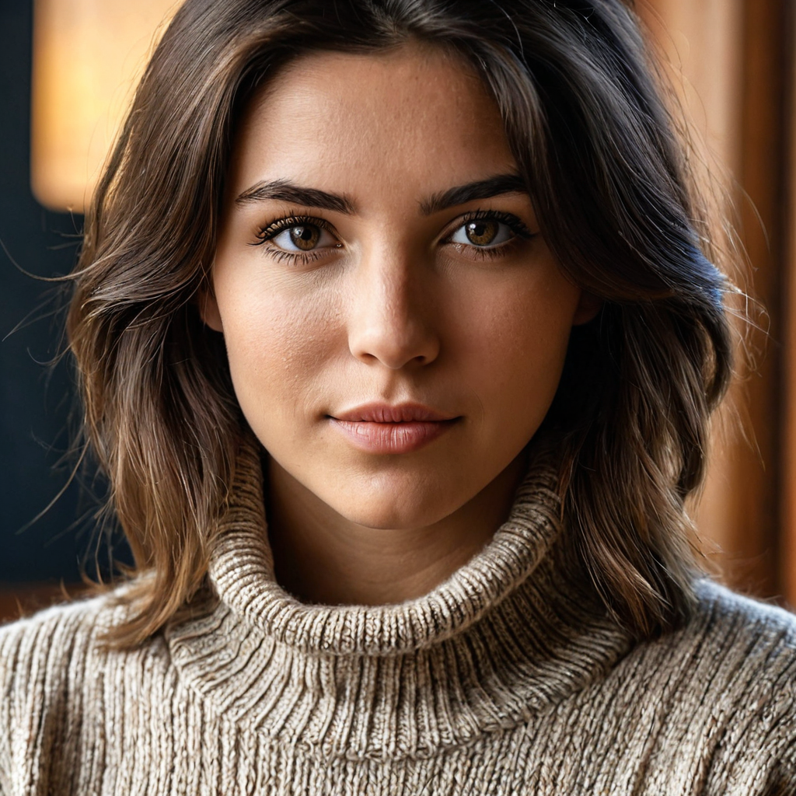
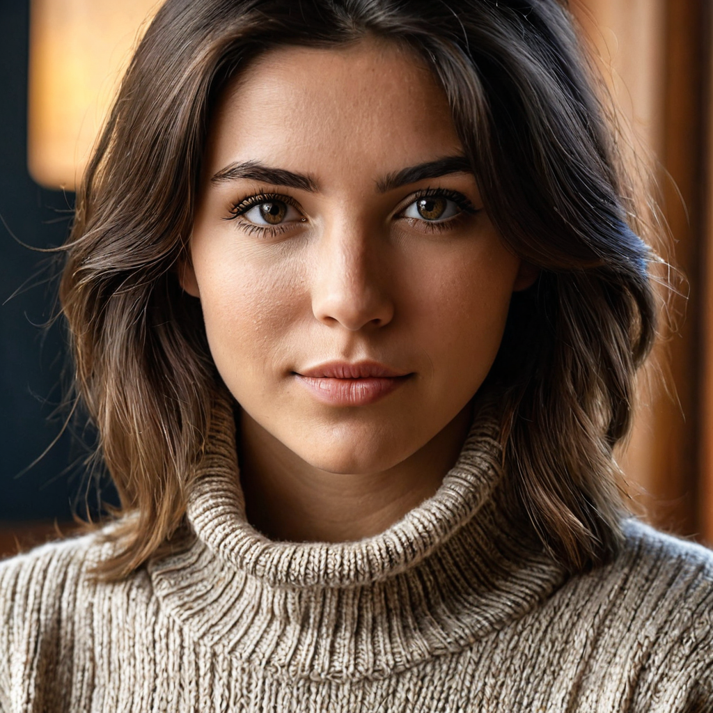
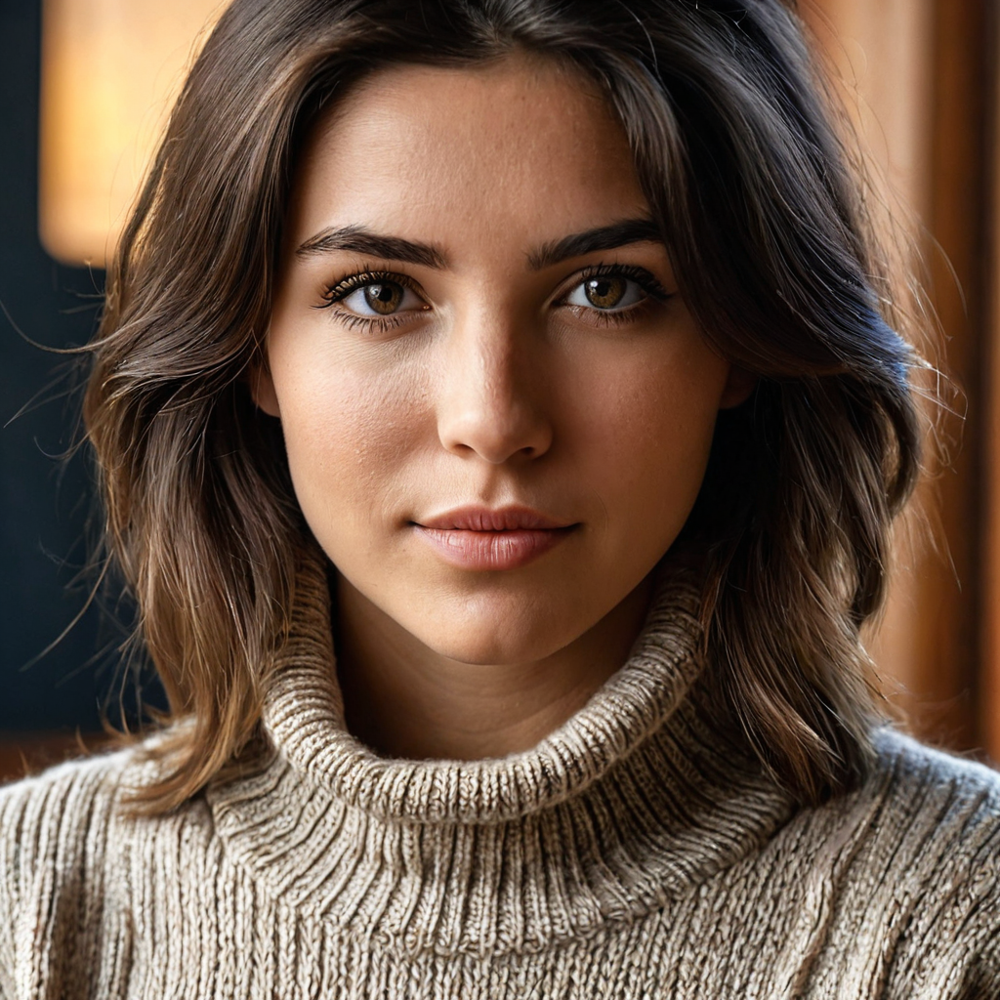
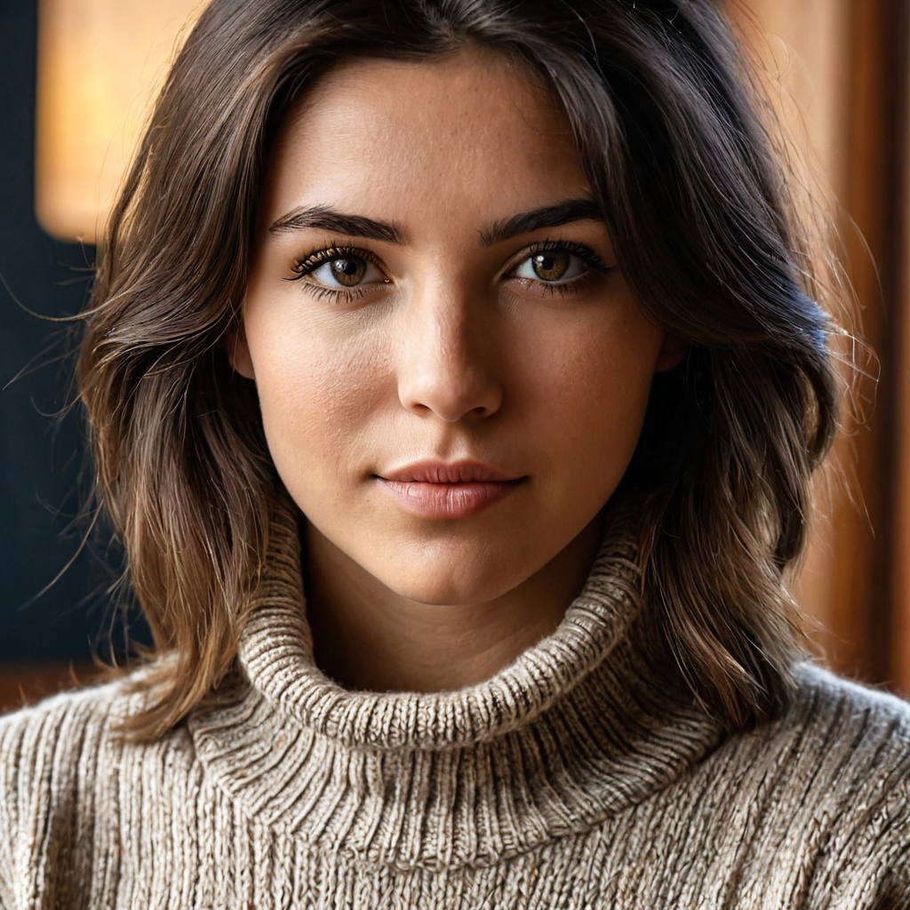
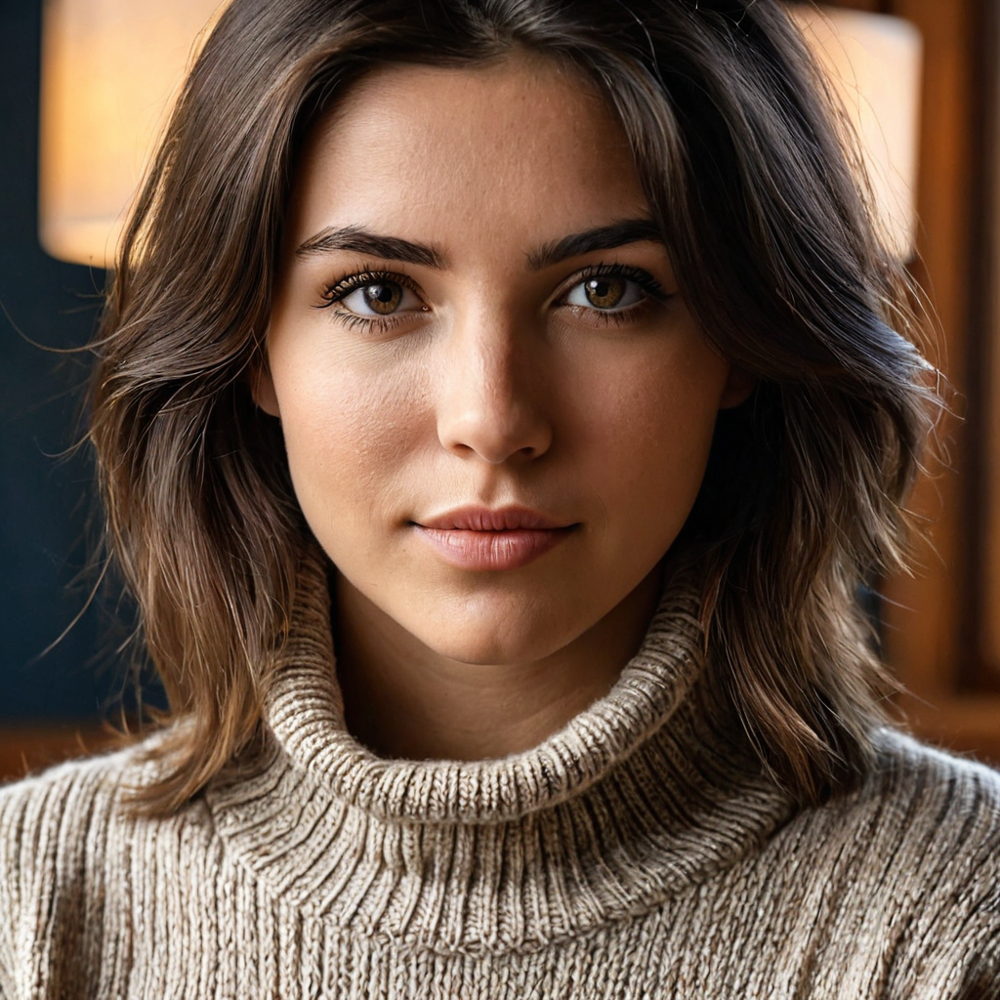
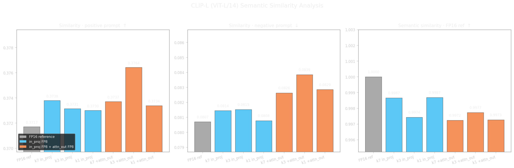

# safetensors-goodies

A collection of command-line utilities for working with diffusion model files in `.safetensors` format, aimed at technically proficient users comfortable with CLI tools.


## [safetensors-extract.py](doc/safetensors-extract.md)

Extracts individual components (UNet/Transformer/DiT, VAE, text encoders) from a full diffusion model checkpoint into separate `.safetensors` files, with automatic architecture detection and ComfyUI-compatible key renaming.

The main use case is preparing components for independent quantization. The typical workflow is to extract the components with this script, convert them to GGUF format using the conversion tools bundled with [ComfyUI-GGUF](https://github.com/city96/ComfyUI-GGUF), and then quantize them with `llama-quantize` from [llama.cpp](https://github.com/ggerganov/llama.cpp) using [city96's diffusion model patch](https://github.com/city96/ComfyUI-GGUF/blob/main/tools/README.md). This makes it possible to produce any K-quant variant (Q2_K, Q3_K, Q4_K, Q5_K, Q6_K, Q8_0, etc.) for any component of any supported architecture — something that checkpoint authors rarely provide beyond a handful of FP8 or INT4 releases.

### SDXL Pipeline Comparison: Checkpoint vs GGUF + VAE Configurations

This section validates that different SDXL pipeline configurations produce equivalent results.

All three images were generated using the same prompt, seed, and sampler settings.

* **Checkpoint:** [cyberrealisticXL v9.0](https://civitai.com/models/312530?modelVersionId=2611295) by [Cyberdelia](https://civitai.com/user/Cyberdelia)
* **Prompt:** *ultra detailed bust portrait of a 28-year-old woman, medium shot, wearing turtle neck sweater, subject centered, natural framing, 50mm lens, realistic skin texture, detailed eyes, soft cinematic lighting, professional photography, high dynamic range, sharp focus, natural colors*
* **Negative prompt:** *lowres, blurry, oversharpened, jpeg artifacts, bad anatomy, extra fingers, deformed hands, cross-eye, plastic skin, overexposed, underexposed, watermark, text, logo*
* **Sampler:** dpmpp_2m
* **Scheduler:** karras
* **Steps:** 30
* **Denoise:** 1.0

| [](assets/sdxl_checkpoint-fp16.png) | [](assets/sdxl_gguf-fp16_clip_vae.png) | [](assets/sdxl_gguf-fp16_clip_vae-fp16-fix-fp16.png) |
|:---:|:---:|:---:|
| <small>**Full checkpoint — FP16**<br>Standard SDXL checkpoint with the VAE baked in at FP16. Reference output.</small> | <small>**GGUF FP16 + VAE extracted from checkpoint**<br>UNet in GGUF FP16, VAE and CLIP extracted from the same checkpoint in FP16. Pixel-perfect identical to the reference.</small> | <small>**GGUF FP16 + [madebyollin VAE fp16-fix](https://huggingface.co/madebyollin/sdxl-vae-fp16-fix) — FP16**<br>Same as above but with madebyollin's VAE (originally FP32, converted to FP16).</small> |

### Generating Quantized UNets in GGUF Format

The starting point is the original checkpoint in `.safetensors` format. The first step is extracting its components using the `safetensors-extract.py` script:
```bash
$ safetensors-extract.py -i cyberrealisticXL_v90.safetensors -d
```

This generates the following files (all in FP16 in this case):
```
cyberrealisticXL_v90_unet.safetensors
cyberrealisticXL_v90_clip_l.safetensors
cyberrealisticXL_v90_clip_g.safetensors
cyberrealisticXL_v90_vae.safetensors
```

The extracted UNet is then converted to F16 GGUF using the `convert.py` script bundled with [ComfyUI-GGUF](https://github.com/city96/ComfyUI-GGUF):
```bash
$ <path_to_comfyui>/custom_nodes/ComfyUI-GGUF/tools/convert.py \
    --src cyberrealisticXL_v90_unet.safetensors \
    --dst cyberrealisticXL_v90.gguf
```

With the F16 GGUF as a base, the various quantizations can be generated using `llama-quantize`, which is obtained by compiling `llama.cpp` with city96's patch as described in the [official documentation](https://github.com/city96/ComfyUI-GGUF/blob/main/tools/README.md):
```bash
$ llama-quantize cyberrealisticXL_v90.gguf cyberrealisticXL_v90-Q8_0.gguf Q8_0
```

The process is identical for the remaining quantizations, only varying the output filename and the quantization type.

The following table summarizes the file size on disk for each quantization level, using the F16 GGUF as reference, to help you choose one based on your available storage and memory.

| Quantization | File Size |
|:---:|:---:|
| F16 | 4.8 GB |
| Q8_0 | 2.6 GB |
| Q6_K | 2.0 GB |
| Q5_K_S | 1.7 GB |
| Q4_K_M | 1.6 GB |
| Q3_K_M | 1.2 GB |
| Q2_K | 845 MB |

Once the quantized GGUF files are generated, they can be loaded directly into ComfyUI using the **GGUF Loader** node included in [ComfyUI-GGUF](https://github.com/city96/ComfyUI-GGUF), with no additional steps required.

The following table shows the difference between some of the K-quants available with `llama-quantize`.

|  |  |  |
|:---:|:---:|:---:|
| Q8_0 | Q6_K | Q4_K_M |

## [quantize-clip_g.py](doc/quantize-clip_g.md)

Applies mixed FP16/FP8 quantization to a CLIP-G text encoder (OpenCLIP format). CLIP-G is one of the text encoders used in SDXL-based models and, at around 1.3 GB, it is a non-trivial memory cost for users with limited VRAM. This script is an experiment in selective quantization: rather than applying a uniform precision reduction, it keeps the most sensitive transformer blocks at FP16 and quantizes only the intermediate blocks where the quality impact is lower, with fine-grained control over which weight tensors are quantized. The goal is to reduce memory footprint with minimal quality loss.

The script includes an analysis mode (`--analyze`) that measures per-block quantization sensitivity and recommends which blocks to protect, making it easier to find a good precision/quality trade-off for a specific model.

The following images were generated with SDXL using partially quantized CLIP-G text encoder. The encoder is quantized to FP8 (E4M3) in intermediate blocks only; the last block (31) and the first N (expressed by the parameter `-k`) blocks are always preserved at FP16. MLP weights (`mlp.c_fc`, `mlp.c_proj`) and the fused attention input projection (`attn.in_proj_weight`) are quantized by default. The table explores two variables:

- Number of initial blocks preserved at FP16 (`-k 7`, `-k 3`, `-k 1`), from most conservative to most aggressive.
- Whether the attention output projection (`attn.out_proj.weight`) is also quantized to FP8 via `--attn-out-fp8`.

| | k=7 | k=3 | k=1 |
|---|:---:|:---:|:---:|
| in_proj FP8 |  |  |  |
| in_proj FP8<br>attn_out FP8 |  |  |  |

The chart below measures semantic fidelity using a CLIP-L (ViT-L/14) model loaded from a local checkpoint. Each image was encoded and compared against the positive prompt, the negative prompt, and the FP16 reference along three axes:

- **Similarity · positive prompt**: all quantized variants score on par with the
  reference, confirming that prompt alignment is preserved.
- **Similarity · negative prompt**: a small but consistent upward drift is visible as quantization becomes more aggressive, particularly when `attn_out` is also quantized. Values remain low in absolute terms (~0.081–0.084).
- **Semantic similarity · FP16 ref**: the least aggressive configuration (k=7, `in_proj` only) stays closest to the original (0.9953). All variants remain above 0.997, indicating no meaningful semantic degradation.



## Requirements

```
torch
safetensors
```

```
pip install torch safetensors
```
